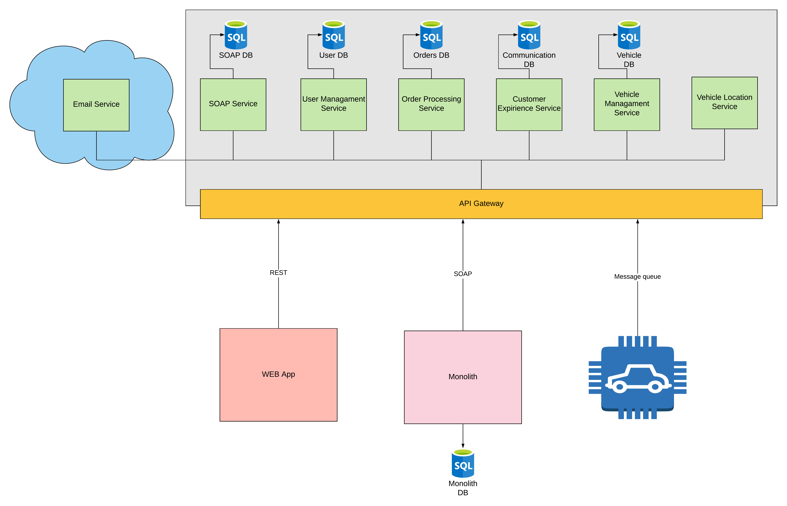

# XML_FTN

## System Architecture

Diagram below describes architecture of our system:

### Back-end
Microservices architecture made of multiple components, where each of them is responsible for different functionality.

#### API Gateway
- API managament tool that sits between clients and a collection of backend services.
- Responsible for request routing, composition and protocol translation.

#### User Managament Service
- Microservice responsible for managing users, their roles and performing authorization and authentication.
- Has a SQL database, where user related data is stored.

#### Order Processing Service
- Microservice responsible for managing vehicle rent requests. This means creating new requests, calculating price, managing order reports, keeping track and updating of current rent status, etc.
- Has a SQL database which stores order related data.

#### Customer Experience Service
- Service in charge of:
  - Communication between agents and customers
  - Car review and rating functionality
- Has a SQL database where communication and ratings are stored.

#### Vehicle Managament Service
- Acts like CRUD service. Manages vehicle related entities such as vechile, vehicle model, brand, prices, images...
- Has a SQL database where it keeps its data.

#### SOAP Service
- Enables external businesses to consume backend functionallity using SOAP protocol.
- Listens for SOAP requests and consumes other microservicess accordingly.
- Keeps track of registred businesss using SQL database.

#### Vehicle Location Service
- Listens for location messages comming from vehicles and provides that messages to the users.

#### Email Service
- Online deployed service responsible of sending emails comming from message queue.

## Web Application
- Frontend application which uses backend functionality via REST communication.

## Agent Application
- External business which uses backend functionality via SOAP communication.
- Has its own database with business specific data, which consists of the following schemas:

## Android application
- Application located in the vehicles which sends location data to Vehicle Location Service.
